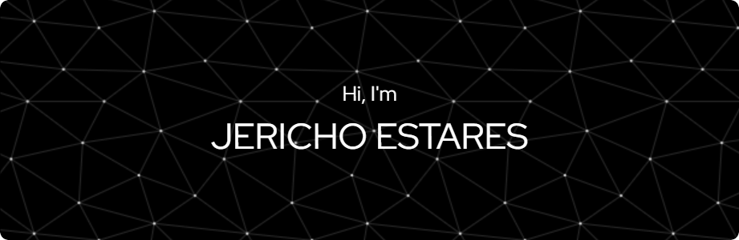

  
  
  
  

  
  
  

---

### 👨‍💻 About Me

I am a systematic and meticulous **Information Technology** professional with a core focus on **Deep Learning**. I am passionate about engineering trustworthy scripts and innovative systems to solve complex problems.

- 🔭 **Current Focus:** Open-source maintenance and AI development.
- 💡 **Philosophy:** Quality code and transparent communication are the pillars of great architecture.
- 💬 **Open for:** Brainstorming new ideas or helping with technical roadblocks.

---

### 🛠️ Technical Ecosystem

| **Core Languages** | **Web & Backend** | **Databases & Cloud** | **Tools & Engines** |
| :--- | :--- | :--- | :--- |
|  |  |  |  |
|  |  |  |  |
|  |  |  |  |
|  |  |  |  |

---

### 🚀 Featured Projects

| Project Name | Category | Tech Stack | Action |
| :--- | :--- | :--- | :--- |
| **SourceGoose** | 🌐 Web Platform | `Next.js` `Node.js` | [**Visit Site**](https://source-goose-official.vercel.app/) |
| **IdentifEYE** | 👁️ Computer Vision | `Deep Learning` `Python` | [**Visit Site**](https://identifeyeph.web.app/) |
| **AGUSTO** | 🛡️ Pentesting/AI | `AI` `Security` | [**View Repo**](https://github.com/jfouryeah12/AGUSTO) |
| **Tophet** | 🎨 Security Design | `UI/UX` `Antivirus` | [**View Repo**](https://github.com/jfouryeah12/Tophet) |
| **Crypto Tools** | 🔐 Cryptography | `Security` `Algorithms` | [**View Repo**](https://github.com/jfouryeah12/Cryptography-Tools) |

---

### 🥇 Credentials & Certifications

| Status | Certification Program | Authority | Date |
| :---: | :--- | :--- | :--- |
| ✅ | **SAP Business One Certificate** | STI SJDM | March 2021 |
| ✅ | **SAP Business One (Financial & Logistic)** | STI SJDM | March 2021 |

---

  
   
  <em><b>Let's build something impactful together!</b> 😃</em>

